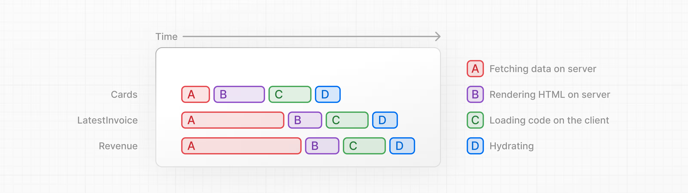

# Next.js App Router Course - Starter

Run `pnpm i` to install the project's packages.

Followed by `pnpm dev` to start the development server.

`pnpm dev` starts your Next.js development server on `port 3000`

---

## Styling

When you use create-next-app to start a new project, Next.js will ask if you want to use Tailwind. If you select `yes`, **Next.js** will automatically install the necessary packages and configure **Tailwind** in your application.

**Tailwind** and **CSS** modules are the two most common ways of styling Next.js applications.

_/app/ui/home.module.css_

```css
.shape {
  height: 0;
  width: 0;
  border-bottom: 30px solid black;
  border-left: 20px solid transparent;
  border-right: 20px solid transparent;
}
```

_/app/page.tsx_

```typescript

import AcmeLogo from '@/app/ui/acme-logo';
import { ArrowRightIcon } from '@heroicons/react/24/outline';
import Link from 'next/link';
import styles from '@/app/ui/home.module.css';

export default function Page() {
  return (
    <main className="flex min-h-screen flex-col p-6">
      <div className={styles.shape} />
    // ...
  )
}
```

### `clsx`

`clsx` is a library that lets you toggle class names easily.

_/app/ui/invoices/status.tsx_

```typescript


import clsx from 'clsx';

export default function InvoiceStatus({ status }: { status: string }) {
  return (
    <span
      className={clsx(
        'inline-flex items-center rounded-full px-2 py-1 text-sm',
        {
          'bg-gray-100 text-gray-500': status === 'pending',
          'bg-green-500 text-white': status === 'paid',
        },
      )}
    >
    // ...
)}

```

> Take a look at the [CSS documentation](https://nextjs.org/docs/app/getting-started/css) for more information.

### Fonts

**Next.js** automatically optimizes fonts in the application when you use the next/font module. It downloads font files at build time and hosts them with your other static assets. This means when a user visits your application, there are no additional network requests for fonts which would impact performance.

_/app/ui/fonts.ts_

```typescript
import { Inter, Lusitana } from "next/font/google";

export const inter = Inter({ subsets: ["latin"] });

export const lusitana = Lusitana({
  weight: ["400", "700"],
  subsets: ["latin"],
});
```

_/app/layout.tsx_

```tsx
import "@/app/ui/global.css";
import { inter } from "@/app/ui/fonts";

export default function RootLayout({
  children,
}: {
  children: React.ReactNode;
}) {
  return (
    <html lang="en">
      <body className={`${inter.className} antialiased`}>{children}</body>
    </html>
  );
}
```

### Images

**Next.js** can serve static assets, like images, under the top-level `/public` folder. Files inside `/public` can be referenced in your application.

With regular HTML, you would add an image as follows:

```html

```

However, this means you have to manually:

- Ensure your image is responsive on different screen sizes.
- Specify image sizes for different devices.
- Prevent layout shift as the images load.
- Lazy load images that are outside the user's viewport.

Images without dimensions and web fonts are common causes of layout shift due to the browser having to download additional resources.

> Instead of manually implementing these optimizations, you can use the `next/image` component to automatically optimize your images.

**The `<Image>` component**

The `<Image>` Component is an extension of the HTML `` tag, and comes with automatic image optimization, such as:

- Preventing layout shift automatically when images are loading.
- Resizing images to avoid shipping large images to devices with a smaller viewport.
- Lazy loading images by default (images load as they enter the viewport).
- Serving images in modern formats, like WebP and AVIF, when the browser supports it.

_/app/page.tsx_

```typescript
import AcmeLogo from '@/app/ui/acme-logo';
import { ArrowRightIcon } from '@heroicons/react/24/outline';
import Link from 'next/link';
import { lusitana } from '@/app/ui/fonts';
import Image from 'next/image';

export default function Page() {
  return (
    // ...
    <div className="flex items-center justify-center p-6 md:w-3/5 md:px-28 md:py-12">
      {/* Add Hero Images Here */}
      <Image
        src="/hero-desktop.png"
        width={1000}
        height={760}
        className="hidden md:block"
        alt="Screenshots of the dashboard project showing desktop version"
      />
    </div>
    //...
  );
}

```

It's good practice to set the `width` and `height` of your images to avoid layout shift, these should be an aspect ratio identical to the source image. These values are _not_ the size the image is rendered, but instead the size of the actual image file used to understand the aspect ratio.

Notice the class hidden to remove the image from the DOM on mobile screens, and `md:block` to show the image on desktop screens.

---

## Routing

### Nested routing

**Next.js** uses file-system routing where **folders** are used to create nested routes. Each folder represents a **route segment** that maps to a **URL segment.**

In this application, you already have a page file: `/app/page.tsx` - this is the home page associated with the route `/`.

You can create separate UIs for each route using `layout.tsx` and `page.tsx` files.

`page.tsx` is a special **Next.js** file that exports a React component, and it's required for the route to be accessible.

`app/dashboard/page.tsx`

`app/dashboard/invoices/page.tsx`

Dashboards have some sort of navigation that is shared across multiple pages. In Next.js, you can use a special `layout.tsx` file to create UI that is shared between multiple pages.

`/app/dashboard/layout.tsx`

One benefit of using layouts in **Next.js** is that on navigation, only the page components update while the layout won't re-render. This is called partial rendering which preserves client-side React state in the layout when transitioning between pages.

### Route Groups

Route groups allow you to organize files into logical groups without affecting the URL path structure. When you create a new folder using parentheses `()`, the name won't be included in the URL path. For example, `/dashboard/(overview)/page.tsx` becomes `/dashboard`.

You can also use route groups to separate your application into sections (e.g. `(marketing)` routes and `(shop)` routes) or by teams for larger applications.

---

## Root Layout

A root `layout` is required in every **Next.js** application. Any UI you add to the root layout will be shared across all pages in your application. You can use the root layout to modify your `<html>` and `<body>` tags, and add metadata.

Since the new layout you've just created (`/app/dashboard/layout.tsx`) is unique to the `dashboard` pages, you don't need to add any UI to the root layout above.

---

## The `<Link>` component

In Next.js, you can use the `<Link />` Component to link between pages in your application. `<Link>` allows you to do [client-side navigation](https://nextjs.org/docs/app/getting-started/linking-and-navigating#how-routing-and-navigation-works) with JavaScript.

> Whenever `<Link>` components appear in the browser's viewport, Next.js automatically prefetches the code for the linked route in the background. By the time the user clicks the link, the code for the destination page will already be loaded in the background, and this is what makes the page transition near-instant!

### Showing active links

Next.js provides a React hook called `usePathname()` that you can use to to get the user's current path from the URL and implement a common UI pattern, that is to show an active link to indicate to the user what page they are currently on.

> Since `usePathname()` is a React hook, you'll need to turn you page into a Client Component.

You can use the `clsx` library introduced in the chapter on CSS styling to conditionally apply class names when the link is active. When `link.href` matches the `pathname`, the link should be displayed with blue text and a light blue background.

```tsx
'use client';

import Link from 'next/link';
import { usePathname } from 'next/navigation';
import clsx from 'clsx';

// ...
            className={clsx(
              'flex h-[48px] grow items-center justify-center gap-2 rounded-md bg-gray-50 p-3 text-sm font-medium hover:bg-sky-100 hover:text-blue-600 md:flex-none md:justify-start md:p-2 md:px-3',
              {
                'bg-sky-100 text-blue-600': pathname === link.href,
              },
            )}
```

---

## React Server Components

By default, Next.js applications use **React Server Components**. Fetching data with Server Components is a relatively new approach and there are a few benefits of using them:

- Server Components support JavaScript Promises, providing a solution for asynchronous tasks like data fetching natively. You can use `async/await` syntax without needing `useEffect`, `useState` or other data fetching libraries.
- Server Components run on the server, so you can keep expensive data fetches and logic on the server, only sending the result to the client.
- Since Server Components run on the server, you can query the database directly without an additional API layer. This saves you from writing and maintaining additional code.

### Static Rendering

With static rendering, data fetching and rendering happens on the server at build time (when you deploy) or when revalidating data.

Benefits:

- Faster websites
- Reduced Server Load
- SEO

> Static rendering is useful for UI with no data or data that is shared across users, such as a static blog post or a product page. It might not be a good fit for a dashboard that has personalized data which is regularly updated.

### Dynamic Rendering

With dynamic rendering, content is rendered on the server for each user at request time (when the user visits the page).

Benefits:

- Real-Time Data
- User-Specific Content
- Request Time Information

### Streaming

It is a data transfer technique that allows you to break down a route into smaller "chunks" and progressively stream them from the server to the client as they become ready, preventing slow data requests from blocking your whole page



There are two ways you implement streaming in **Next.js**:

1. At the page level, with the `loading.tsx` file (which creates `<Suspense>` for you).
2. At the component level, with `<Suspense>` for more granular control.

> `loading.tsx` is a special Next.js file built on top of React Suspense. It allows you to create fallback UI to show as a replacement while page content loads.

### Loading Skeletons

A loading skeleton is a simplified version of the UI. Many websites use them as a placeholder (or fallback) to indicate to users that the content is loading.

_/app/dashboard/loading.tsx_

```tsx
import DashboardSkeleton from "@/app/ui/skeletons";

export default function Loading() {
  return <DashboardSkeleton />;
}
```

### `<Suspense>`

Suspense allows you to defer rendering parts of your application until some condition is met (e.g. data is loaded). You can wrap your dynamic components in `Suspense`. Then, pass it a fallback component to show while the dynamic component loads.

Where you place your Suspense boundaries will depend on a few things:

1. How you want the user to experience the page as it streams.
2. What content you want to prioritize.
3. If the components rely on data fetching.

> Where you place your suspense boundaries will vary depending on your application. In general, it's good practice to move your data fetches down to the components that need it, and then wrap those components in Suspense, creating more granular Suspense boundaries. This allows you to stream specific components and prevent the UI from blocking.. But there is nothing wrong with streaming the sections or the whole page if that's what your application needs.

---

## URL search params

Benefits of implementing search with URL params:

- **Bookmarkable and shareable URLs:** Since the search parameters are in the URL, users can bookmark the current state of the application, including their search queries and filters, for future reference or sharing.
- **Server-side rendering:** URL parameters can be directly consumed on the server to render the initial state, making it easier to handle server rendering.
- **Analytics and tracking:** Having search queries and filters directly in the URL makes it easier to track user behavior without requiring additional client-side logic.

### Adding the search functionality

These are the **Next.js** client hooks that you can use to implement the search functionality:

- `useSearchParams` - Allows you to access the parameters of the current URL. For example, the search params for this URL `/dashboard/invoices?page=1&query=pending` would look like this: `{page: '1', query: 'pending'}`.
- `usePathname` - Lets you read the current URL's pathname. For example, for the `route /dashboard/invoices`, `usePathname` would return `'/dashboard/invoices'`.
- `useRouter` - Enables navigation between routes within client components programmatically.

> `URLSearchParams` is a Web API that provides utility methods for manipulating the URL query parameters. Instead of creating a complex string literal, you can use it to get the params string like `?page=1&query=a`.

Here's a quick overview of the implementation steps:

- Capture the user's input.
- Update the URL with the search params.
- Keep the URL in sync with the input field.
- Update the related component to reflect the search query.

_/app/ui/search.tsx_

```tsx
"use client";

import { useSearchParams, usePathname, useRouter } from "next/navigation";

export default function Search({ placeholder }: { placeholder: string }) {
  const searchParams = useSearchParams();
  const pathname = usePathname();
  const { replace } = useRouter();

  function handleSearch(term: string) {
    const params = new URLSearchParams(searchParams);
    if (term) {
      params.set("query", term);
    } else {
      params.delete("query");
    }
    replace(`${pathname}?${params.toString()}`);
  }
  return (
    <div className="relative flex flex-1 flex-shrink-0">
      <label htmlFor="search" className="sr-only">
        Search
      </label>
      <input
        className="peer block w-full rounded-md border border-gray-200 py-[9px] pl-10 text-sm outline-2 placeholder:text-gray-500"
        placeholder={placeholder}
        onChange={(e) => {
          handleSearch(e.target.value);
        }}
        defaultValue={searchParams.get("query")?.toString()}
      />
    </div>
  );
}
```

> `defaultValue` vs. `value` / **Controlled vs. Uncontrolled**

> If you're using state to manage the `value` of an input, you'd use the value attribute to make it a controlled component. This means React would manage the input's state. However, since you're not using state, you can use `defaultValue`. This means the native input will manage its own state. This is okay since you're saving the search query to the URL instead of state.

### When to use the `useSearchParams()` hook vs. the `searchParams` prop?

You might have noticed you used two different ways to extract search params. Whether you use one or the other depends on whether you're working on the client or the server.

- `<Search>` is a Client Component, so you used the `useSearchParams()` hook to access the params from the client.
- `<Table>` is a Server Component that fetches its own data, so you can pass the `searchParams` prop from the page to the component.

> As a general rule, if you want to read the params from the client, use the `useSearchParams()` hook as this avoids having to go back to the server.

### Debouncing

Debouncing is a programming practice that limits the rate at which a function can fire. In our case, you only want to query the database when the user has stopped typing.

**How Debouncing Works:**

1. **Trigger Event:** When an event that should be debounced (like a keystroke in the search box) occurs, a timer starts.
2. **Wait:** If a new event occurs before the timer expires, the timer is reset.
3. **Execution:** If the timer reaches the end of its countdown, the debounced function is executed.

---

## React Server Actions

React Server Actions allow you to run asynchronous code directly on the server. They eliminate the need to create API endpoints to mutate your data. Instead, you write asynchronous functions that execute on the server and can be invoked from your Client or Server Components.

They include features like encrypted closures, strict input checks, error message hashing, host restrictions, and more — all working together to significantly enhance your application security.

### Using forms with Server Actions

In React, you can use the action attribute in the `<form>` element to invoke actions.

```typescript
// Server Component
export default function Page() {
  // Action
  async function create(formData: FormData) {
    'use server';

    // Logic to mutate data...
  }

  // Invoke the action using the "action" attribute
  return <form action={create}>...</form>;
}
```

> `use server` marks [server-side functions](https://react.dev/reference/rsc/use-server) that can be called from client-side code.

> An advantage of invoking a Server Action within a Server Component is progressive enhancement - forms work even if JavaScript has not yet loaded on the client. For example, without slower internet connections.

### Next.js with Server Actions

Server Actions are also deeply integrated with Next.js [caching](https://nextjs.org/docs/app/guides/caching-without-cache-components). When a form is submitted through a Server Action, not only can you use the action to mutate data, but you can also revalidate the associated cache using APIs like `revalidatePath` and `revalidateTag`.

### Using Server Actions in this project: Creating an invoice

1. Create a form to capture the user's input.
2. Create a Server Action and invoke it from the form.
3. Inside your Server Action, extract the data from the formData object.
4. Validate and prepare the data to be inserted into your database.
5. Insert the data and handle any errors.
6. Revalidate the cache and redirect the user back to invoices page.

> Check `/dashboard/invoices/create/page.tsx`

**Good to know:** In HTML, you'd pass a URL to the `action` attribute in your form. This URL would be the destination where your form data should be submitted (usually an API endpoint).

However, in React, the `action` attribute is considered a special prop - meaning React builds on top of it to allow actions to be invoked.

Behind the scenes, Server Actions create a `POST` API endpoint. This is why you don't need to create API endpoints manually when using Server Actions.

> Check `/app/ui/invoices/create-form.tsx`

> Tip: If you're working with forms that have many fields, you may want to consider using the [`entries()`](https://developer.mozilla.org/en-US/docs/Web/API/FormData/entries) method with JavaScript's [`Object.fromEntries()`](https://developer.mozilla.org/en-US/docs/Web/JavaScript/Reference/Global_Objects/Object/fromEntries).

### Revalidate and redirect

Next.js has a client-side router cache that stores the route segments in the user's browser for a time. Along with [prefetching](https://nextjs.org/docs/app/getting-started/linking-and-navigating#1-prefetching), this cache ensures that users can quickly navigate between routes while reducing the number of requests made to the server.

You can use the `revalidatePath` function from Next.js to update the data displayed, clear this cache and trigger a new request to the server.

You can use the `redirect` function from Next.js to redirect the user back to thepage you want.

## Dynamic Route Segment

Next.js allows you to create [Dynamic Route Segments](https://nextjs.org/docs/app/api-reference/file-conventions/dynamic-routes) when you don't know the exact segment name and want to create routes based on data. This could be blog post titles, product pages, etc. You can create dynamic route segments by wrapping a folder's name in square brackets. For example, `[id]`, `[post]` or `[slug]`.

---

> This is the starter template for the Next.js App Router Course. It contains the starting code for the dashboard application. For more information, see the [course curriculum](https://nextjs.org/learn) on the Next.js Website.
